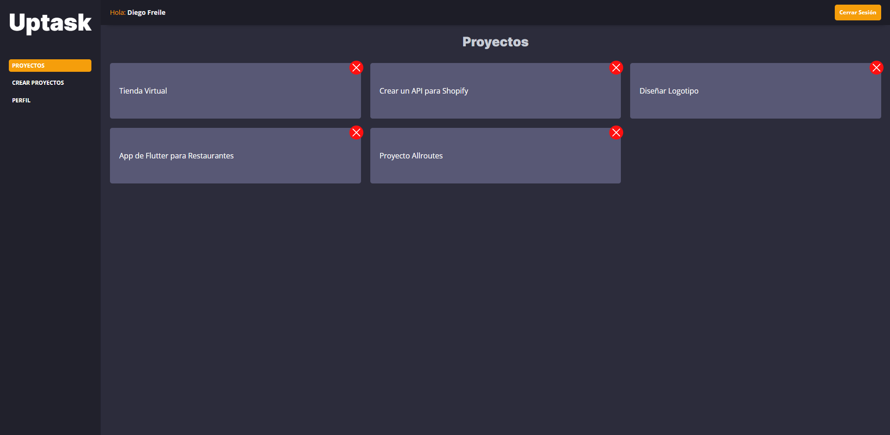

# UpTask :memo:

App para realizar seguimientos de tus proyectos. Relizada con:

- PHP
- SASS
- Gulp
- JavaScript

<p align="center">
     &#127760; Link a la Demo &#128073; <a href="https://zovfene.domcloud.io/" target="_blank">Pulsar Aquí</a>
</p>

## Depliegue en maquina local

Realizar los siguientes pasos:

1. Descargar el proyecto comprimido en .zip y descomprimirlo.
2. Importar el archivo ```uptask_mvc.sql``` para crear la base de datos y sus respectivas tablas.
3. Ejecutar los comandos ```npm install``` y ```composer install``` para instalar las dependencias necesarias.
4. Crear un archivo ```.env``` dentro de la carpeta ```/includes``` con la siguiente estructura:

    ```text
    DB_HOST = localhost
    DB_USER = # Usuario de la base de datos
    DB_PASS = # Contraseña del usuario
    DB_NAME = uptask_mvc

    EMAIL_HOST = # Dominio o ip del servidor smtp
    EMAIL_PORT = # Puerto
    EMAIL_USER = # Nombre de usuario
    EMAIL_PASS = # Contraseña del usuario

    APP_URL = http://localhost:3000
    ```

5. En la linea de comandos situarnos en la carpeta ```/public``` y ejecutar el comando ```php -S localhost:3000``` para abrir un servidor local en el puerto 3000 y poder ver el proyecto en el navegador.

> Si se quiere hacer algún cambio en los estilos, js o imagenes, ejecutar el comando ```npm run dev``` para ejecutar el workflow del gulpfile y escuche por los cambios.

## Imagen del proyecto :computer:

<p align="center">
    
</p>
